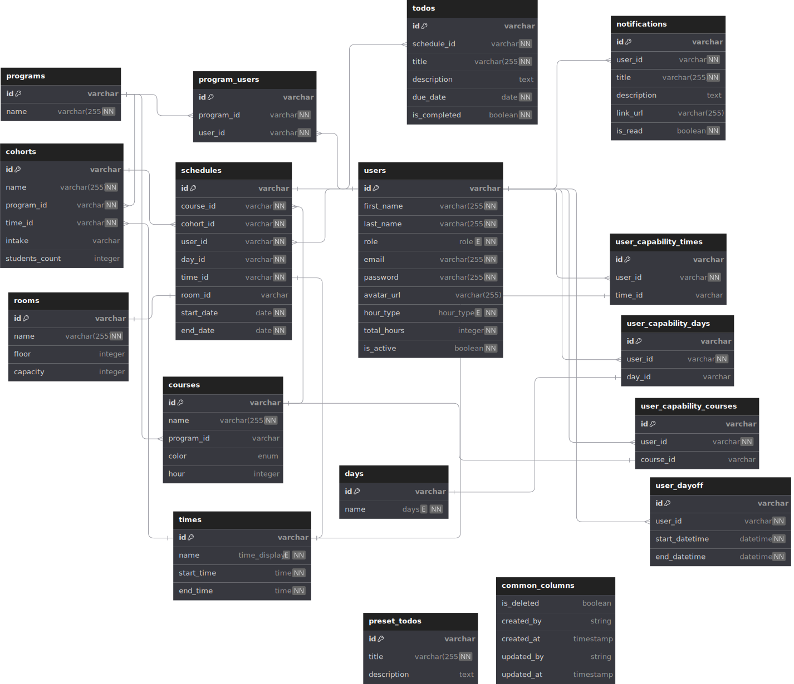
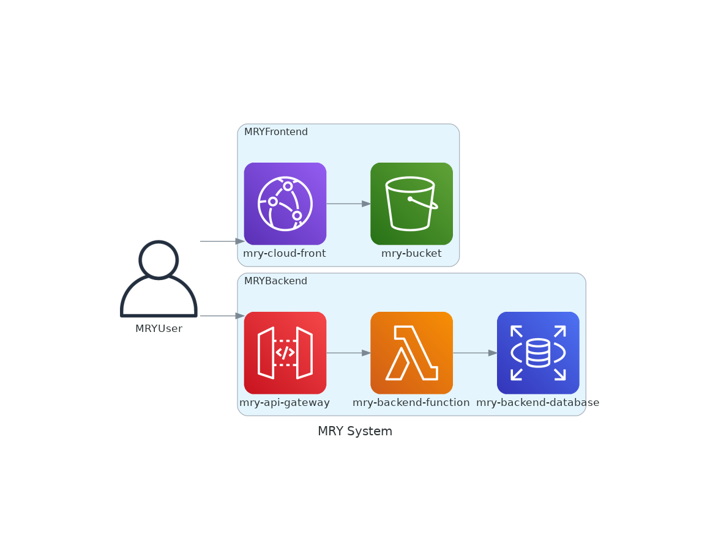

# MRY Project

This repository is copied from original private repository for a program project in my school

## Introduction video

## Background

There is a manager who manages school schedules and assigns instructors using google spreadsheet, notion and other documents.\
There are many conditions need to be considered and those underlying information are scattered to various places.\
This app was designed to reduce the workload of the manager by centralizing information and enable searching appropriate instructors considering various conditions.

## Team member

3 people including myself

## Development Duration

Feb/2024 ~ Apr/2024 3 months

## What I contributed with this project

I took cahrge of backend (NestJs), database table design, infrastructure (GitHubActions, AWS) and OAuth (Google) integration with frontend.

## Features

- Authentication
  - local and OAuth(Google Only)
  - Signin/up/Logout with JWT token
- Dashboard
  - upcoming schedule view for a both manager and instructor
- Program
  - manage programs in the school which contains a certain set of courses
  - CRUD operations for program data
- Cohort
  - manage cohort(class) schedules
  - CRUD operations for cohort data
  - calculation of available instructors and rooms
  - copy feature from existing one
  - auto generator
- Schedule
  - gantt chart view of all schedules
  - drag and drop feature for assigning available instructors
- Instructor
  - manage instructor data
  - CRUD operations for instructor preference, capability, contract, dayoffs
- Notification
  - manage notification from instructor to manager and vise versa

## Tech Stack

### Frontend

- Next.js
- SASS

### Backend

- Nest.js
- PostgreSQL
- TypeORM

## ERD

[source link](https://dbdiagram.io/d/Copy-of-MRY-ERD-RDB-665478ecb65d933879c4daa1)

  

## System diagram

  

